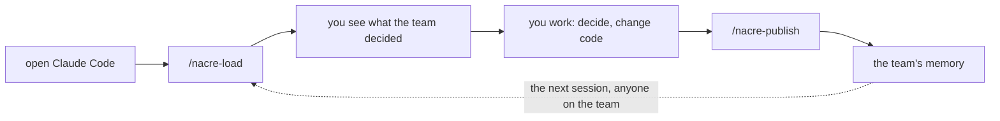
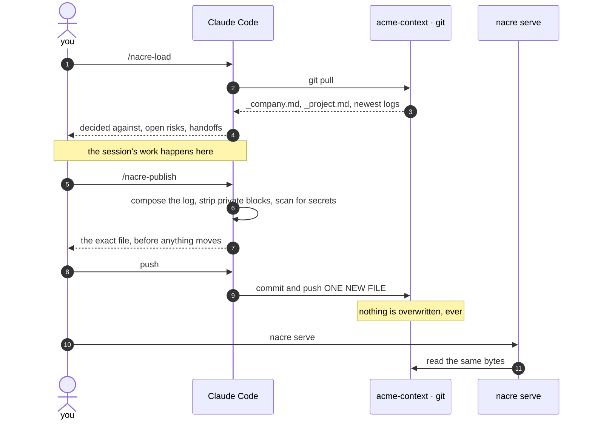

<div align="center">

# nacre

**One context memory for your whole company — every project, every repo, every
person. Agents and people read the same files.**

Your agent remembers a session. Your team remembers nothing. nacre gives a
company one shared memory: plain Markdown in a private git repo that an agent
loads at session start and a person browses in a portal, with no database in
between.

Most tools scope memory to a repository. A product is rarely one repository, and
the knowledge that matters most lives in the seam between them. nacre's unit is
the **product**, and above it the **company**.

No vectors. No API key. No service to run. Markdown you can read in a pull request.

</div>

<!-- Outside the centred block on purpose: align="center" centres every LINE of
     a code fence, so a short first line sits indented and the block reads as
     mis-typed code rather than as something to paste. -->

```sh
npm i -g nacre-cli
nacre init git@github.com:acme/acme-context.git
```

<div align="center">

**Working alone?** You want
[create-ai-memory](https://github.com/rambaarde/create-ai-memory) instead —
same idea, one person, no shared repo to set up.

[](https://www.npmjs.com/package/nacre-cli)


</div>

---

## The two commands

<div align="center">
  
</div>

<p align="center"><em>One real session, in order: <code>/nacre-load</code> at the start, <code>/nacre-publish</code> at the end.</em></p>

Two developers on one project. **Bob** is the one in the recording. **Alice** left
a note days earlier and never spoke to him.

### At the start: `/nacre-load`

A fresh Claude Code session starts blind. The previous chat is gone, and nothing
about it carries over on its own.

`/nacre-load` is what fills that in. It reads the team's memory: the project's
rules, everything **decided against**, the open risks, and the newest session logs
— Bob's own and everyone else's.

So when Bob asks what Alice left open, the answer is already in the session:

> **Open risk:** `atlas-web` still reads the old header name. She renamed the
> headers in `atlas-api` and verified them in staging — so the two repos disagree
> right now.
> **Handoff:** *"Remove the old header path in atlas-web — coordinate with bob
> first."*
> **Who it blocks:** it lands on `atlas-web`, and the git user in this checkout is
> bob — so it's on your side of the seam.

Bob never searched. He never opened a portal. He never learned Alice existed — and
her thread came back anyway, with the ordering constraint attached: **deploy
`atlas-web` after `atlas-api`, not before.**

### At the end: `/nacre-publish`

Bob decides the expiry response stays **419** rather than reverting to 401, because
mobile already ships against it.

The agent writes the log. Bob doesn't. Before anything is pushed, it strips any
`<!-- private -->` blocks, scans for secrets, shows him the exact file, and waits.

It also flags one of its own calls: it tagged the log to a single repo, because
that's the only repo the session actually touched. Bob replies *"both repos, then
push"* — one line of typing, and the diff updates to `repos: [atlas-api,
atlas-web]` before it lands.

That decision is now what the next `/nacre-load` on this project surfaces, before
anyone proposes 401 a third time.

### And the part no single repo can tell him

The same memory carries a constraint neither repo owns:

> **One Redis instance, two products.** `atlas-api` and `beacon-api` share it with
> no per-product isolation, so raising atlas's share starves beacon's workers —
> measured by alice 2026-07-28, not theorised. **Neither product's tests will catch
> it.**

Beacon is a different product, with a different team, in a different repo. Bob has
never worked on it. That constraint belongs to two products and lives in neither's
code — which is the whole reason nacre's unit is the company and not the repo.

---

## Why now

Team memory has been a good idea and a dead letter for twenty years. Three things
changed at once.

1. **Agents now produce reasoning worth keeping.** A session discovers a
   constraint, rejects three approaches, and explains why. That output used to be
   a junior's scratch notes. It is now the most valuable artifact of the day, and
   it is thrown away at the end of it.

2. **Adoption went individual-first.** Every developer has an agent. Each one
   starts blind. The context that would help the next person sits in a chat
   thread nobody else can read and no future session inherits.

3. **Writing it down stopped being a human cost.** This is the one that matters.
   Every previous attempt at team memory died because *somebody had to write it*
   — and at 6pm, nobody does. The agent that produced the reasoning can write the
   log. The tax that killed the idea is gone.

nacre is what you do about the third one.

---

## Before and after

| | Before | With nacre |
|---|---|---|
| where reasoning lives | a chat thread that scrolls away | a file in a repo your team already clones |
| a new session | starts blind, re-derives what is known | opens knowing what was decided, and why |
| a rejected approach | rediscovered — sometimes re-shipped, re-broken | recorded, dated, attributed, never struck through |
| a constraint owned by two repos | someone's head, or a Slack thread | the project's memory, which is above both |
| who writes it down | nobody, honestly | the agent, at the end of the session |
| reading it as a person | ask whoever remembers | `nacre serve` — the same files, in a browser |
| the day someone leaves | it goes with them | it is in the history, on every clone |

---

## Two doors, one store

Agents read the memory through two commands — installed for Claude Code, Codex,
Gemini CLI, OpenCode and Cursor, each in that agent's own format, and reachable
over MCP by anything else. People read the same bytes in a local portal — no
login, no database, no build step.

<div align="center">
  
</div>

`⌘K` jumps anywhere in the memory. Underneath, it is markdown you can read in a
pull request. Both recordings are the real product — nothing here is mocked,
restyled, or re-typed.

---

## The problem

The code lands. The reasoning dies with the session.

One developer spends six hours with an agent discovering a constraint, rejecting
three approaches, and shipping a fix. The diff records what changed. Nothing
records *why*, or what was tried and abandoned. Next week someone else — or the
same person with a fresh agent — starts blind and rediscovers it.

You pay the same tax every time:

- **Decisions evaporate.** Why a choice was made lives in a closed chat thread.
- **Rejections are invisible.** Nothing records what was tried and deliberately
  not done, so it gets re-litigated — or re-shipped, and re-broken.
- **Onboarding is oral.** A new teammate's context is whatever someone remembers
  to tell them.
- **Agents restart cold.** Every session re-derives what the team already knows.

**And the knowledge that actually breaks production belongs to no single repo.**
*"The API changed its expiry response; the web app must deploy after it."* That
fact is owned by two repositories and lives in neither — so a per-repo wiki has
nowhere to put it, and it ends up in someone's head or a Slack thread that
scrolls away.

## The promise

When any developer or agent joins a project session, they should understand the
current state, known risks, active decisions, and the next move — within minutes.

> **No teammate starts from zero.**
>
> **No rejected idea gets rediscovered as if new.**
>
> **No production lesson disappears inside a dead transcript.**

One memory per company. Every project inside it, every repo inside those, every
person who works on them — including the ones who joined last week and the ones
who were on leave. Nobody left reconstructing what the team already knew.

## The loop



That is the whole product. Five steps you type, one of which is optional on any
given day.

1. **Open Claude Code.** Nothing special — no flags, no wrapper.
2. **`/nacre-load`.** Pulls the team's memory into the session.
3. **You see what the team decided** — and what they decided *against*, which is
   the part that usually goes missing.
4. **You work.** Decide things, change code. nacre is not involved.
5. **`/nacre-publish`.** The session writes itself down, you approve it, it lands
   in the shared repo.

Then the dotted arrow: the next person to run `/nacre-load` on that project —
including you, tomorrow, with a fresh session — starts from what you just wrote.

Nobody has to remember to tell anybody.

## How it works

One private git repo holds the memory for the whole company. Your code repos
carry a two-line signpost pointing at it — no memory lives in them, only the
address.

```
acme-context/          ← all memory. One repo. Separate from your code.
  _company.md              facts owned by more than one project
  atlas/                   a project
    _project.md              which repos and teams make it up
    devs/dana/               one file per session, never overwritten
  billing/                 another one

atlas-web/.nacre.yml      ← project: atlas · memory: git@…/acme-context.git
atlas-api/.nacre.yml      ← the same two lines
```

**Agents** read it through two skills — one loads what the team decided at
session start, one writes the session's log at the end. **People** read the same
bytes in a local portal.

Both doors, one store. Neither gets a privileged interface.



**Steps 1–4 need no permission. Steps 6–10 do.** A load is a `git pull` and a
file read; it asks nothing and moves nothing off your machine. The write stops
at step 8 and waits for a person — that is the only path into the shared repo.

Step 10 writes a **new file**. It never edits an existing one, so a correction
is a new log carrying `supersedes:` and the log it corrects stays readable
beside it.

Steps 11–12 are the same bytes again, in a browser. No API, no export — the
portal reads the files your agent just read.

## Setup

Install once, then two commands, run by whoever sets things up.

```sh
npm i -g nacre-cli                              # the package; the commands are nacre and nac

nacre init git@github.com:acme/acme-context.git  # once, per company
nacre add atlas ../atlas-web ../atlas-api        # once, per project
```

Trying it without installing works too — `npx nacre-cli init <git-url>`.

Adding a repo later is the same command again:

```sh
nacre add atlas ../atlas-worker
```

`nacre add` also drops a **`SessionStart` hook** into the repo's
`.claude/settings.json`, so Claude Code loads the memory at the start of every
session without anyone remembering to ask. It stays silent while the store is
thin — an empty briefing injected into every session costs context and teaches
people the tool is not worth having. Claude Code only; the other agents read the
`AGENTS.md` note instead. Delete the entry to be rid of it.

Then give each teammate access to the memory — **the one step nothing can do for
you**, because a private repo gives them nothing until they are on it:

```sh
nacre invite dana                                # write access to the memory
```

**Everyone after that installs nothing.** They clone a repo that already carries
`.nacre.yml` and an `AGENTS.md` note, and their agent reads the memory with
`npx nacre-cli brief` — no global install, no setup, nothing to remember. A global
`npm i -g nacre-cli` only makes the command shorter.

If they run it before being invited, nacre says so and names the fix rather than
printing a git error: *the memory is private and you are not on it yet.*

Unsure where you are? Run `nacre` with no arguments — it reports live state and
names the one command that applies next.

```
$ nacre
project: atlas · repos[3]: atlas-api, atlas-web, atlas-worker · logs: 47
memory: ~/acme-context · you are in: atlas-web
next: nacre-load at session start · nacre-publish at the end
```

Every command also works as **`nac`**.

## Read it

```sh
nacre brief            # what the team already decided, before you start
nacre search 419       # the same search the portal uses, same ranking
nacre serve            # the portal, from your own clone. No login.
```

**`nacre brief` is the door that needs no setup at all.** No skill, no MCP client,
no prior knowledge of nacre — any agent that can run a shell command can be told
one line and get the same briefing everything else reads. `nacre add` also leaves
a short note in the repo's `AGENTS.md` saying exactly that, so an agent that has
never heard of nacre still finds it.

Three ways in — **project · person · time** — over one store. The project page
leads with the **handoff**: the next step from the most recent session that named
one. A reader who stops there already knows where the team left off.

Under it sits the curated project note, then every session in order. Decisions,
risks and what was **decided against** stay inside the logs they were made in,
dated and attributed. They are deliberately not collected onto the project page:
after a hundred sessions such a list is neither current nor historical, and
capping it silently drops the entry that mattered. An index is a cache, never a
source.

Decided-against entries are never struck through. Strikethrough reads as
*deleted*; these are live constraints, and they are the class of knowledge
nothing else keeps.

### Whatever your teammates use

A memory only one agent can read is not a team memory, so `nacre add` installs the
two commands **for every agent it finds on the machine** — no flag, nothing to
choose:

| | writes | as |
|---|---|---|
| Claude Code | `~/.claude/skills/` | `SKILL.md` |
| Codex | `~/.codex/skills/` | `SKILL.md` |
| Gemini CLI | `~/.gemini/skills/` | `SKILL.md` |
| OpenCode | `~/.config/opencode/skills/` | `SKILL.md` |
| Cursor | `~/.cursor/rules/` | `.mdc` |

Same two commands, each in that agent's own format. `--agents claude,cursor`
overrides the detection if you want fewer.

For anything not in that table, or an editor you'd rather wire up yourself, the
memory is also an **MCP server**:

```sh
nacre mcp     # stdio JSON-RPC. The client starts this; you never run it yourself.
```

Register it once:

```sh
claude mcp add nacre -- nacre mcp
```

```jsonc
// Cursor, Windsurf, Zed, Codex — .mcp.json / mcp.json
{ "mcpServers": { "nacre": { "command": "nacre", "args": ["mcp"] } } }
```

Two tools, and **both only read**:

| | |
|---|---|
| `nacre_brief` | the project's briefing — company facts, standards, the handoff, what was decided against, open risks, newest sessions |
| `nacre_search` | the same search and the same ranking as the portal |

**Nothing writes.** `/nacre-publish` is safe because a person sees the log and
says yes before it is pushed — and no server can guarantee its client stopped for
a human first. Exposing publishing here would either weaken *nothing is shared by
omission* or fake a gate in a loop this process does not control. Writing stays
human-invoked, through the skill or the CLI, where the gate is real.

## Integrations

Two of them, both **one-way and after the fact**. nacre announces what a person
already published; nothing reads from a vendor, and nothing writes into the
memory without someone present.

**Announce a log to a channel.** Slack, Discord, or anything that takes an
incoming webhook:

```sh
export NACRE_NOTIFY_URL=https://hooks.slack.com/services/...
```

`nacre-publish` posts one line after the push — or run `nacre notify` yourself:

```
bob logged atlas — kept the 419 expiry response; api deploys before web
decided against: reverting to 401 — mobile ships against it (+1 more)
https://linear.app/acme/issue/ENG-421
atlas/devs/bob/atlas-2026-08-06_11-00-00.md
```

The URL is a credential, so it comes from the environment and **never** from the
memory repo, where it would be committed and shared with the whole company. A
webhook that is down or slow is reported and then ignored: the log is already
pushed, and failing the publish over an announcement would send someone hunting a
problem that isn't there.

**Link your issue tracker.** One line in `_company.md`:

```yaml
issues: https://linear.app/acme/issue/{key}
```

Every `ENG-421` in the memory becomes a link — in the portal and in the
announcement. Linear, Jira, Shortcut, GitHub: it is a URL template, not an
integration, so there is no token, no API, and nothing to break when a vendor
changes theirs.

### What nacre will not do

**Pull issues in.** It needs a service running, it writes to the memory with
nobody present — breaking *nothing is shared by omission* — and it buries the
reasoning trail under ticket churn. The trail is the part nothing else keeps;
your tracker is already a better tracker than nacre will ever be.

## Write it

Capture is one motion, and a person is present for all of it:

```
compose → strip <!-- private --> → secret scan → show → push
```

No draft folder, no second command. The private block matters more than it looks:
without somewhere to put the unshareable half, people write nothing at all.

**Nothing is shared by omission**, and nothing reaches the store without someone
seeing it first.

## Why plain files

> **nacre** *(n.)* /ˈneɪkər/ — mother-of-pearl. A mollusc lays it down one
> microscopic layer at a time, aragonite platelet onto organic matrix, and never
> takes one back. The layering is not decoration: it is what makes nacre both
> iridescent and hard to break. Slice a shell and the growth bands read like tree
> rings — a season each, thousands of them, the oldest still exactly where it was
> laid.

**One layer per session. Nothing overwritten.**

Everything else in this space builds **agent memory** — a database the agent
queries. SQLite, vectors, a graph, an extraction pipeline. A human reads it, if
at all, through a debug viewer.

nacre builds **team memory** — a document humans and agents share.

The distinction underneath: **the reasoning trail is episodic, not
encyclopedic.** What a system *is* can be documented and kept current. What
happened, what was tried, what was ruled out and why — that is a sequence of
dated, attributed entries, and it is not an encyclopedia. Plenty of tools are
building the encyclopedia. The trail is the part nobody keeps, and it is the part
that stops a decision being made twice.

It is also why nacre composes rather than competes: if you keep a per-repo
architecture wiki, keep it. This is the layer above it.

| | |
|---|---|
| **Markdown in git** | reviewable in a pull request, greppable, diffable, portable |
| **Nothing captured silently** | a person publishes, or it stays local |
| **Zero inference on reads** | reading is file reads; one model call, and only when you write |
| **Company-wide scope** | company → projects → teams → people, and projects → repos |
| **Integrations are one-way** | nacre announces what a person published; nothing writes in unattended |
| **Append, never reconcile** | new files only; a correction is a new layer, not an edit |

Uninstall nacre and you are left with a git repo of readable Markdown and its
full history. That is the test this design has to keep passing.

## If you are working alone

Use **[create-ai-memory](https://github.com/rambaarde/create-ai-memory)**
(`npm create ai-memory@latest`). Same conviction — plain Markdown you own, no
database, memory that outlives the chat thread — scoped to one person and one
machine.

nacre exists for the part that only shows up with other people: a memory a
teammate reads, a decision that has to survive the person who made it, and a
fact that belongs to two repositories and neither. If nobody else is going to
read it, everything nacre adds is cost — a shared repo to create, a publish step
to remember, a portal nobody opens.

|  | create-ai-memory | nacre |
|---|---|---|
| scope | you | your company |
| memory lives | a vault on your machine | a private git repo the team clones |
| sharing | not the point | the whole point |
| setup | one command | a repo, then one command per project |

They are the same idea at two sizes. Start with the smaller one — it is a real
tool, not a demo, and moving up later is copying Markdown into a different
folder.

## Status

**Early, and honest about it.** The CLI, both skills, and the portal work and are
tested. What has *not* happened is the part that matters: nobody outside the
author has used this with a teammate for two weeks.

That experiment is the point. The unproven half of this idea is not capture, it
is **sharing** — whether a second person reads a shared memory and ever publishes
back to it. If the answer turns out to be no, this should be abandoned rather
than repositioned.

## Open questions

1. Does anyone besides the author care that the memory is human-readable?
2. With writing human-invoked, will a second person record anything at all?
3. Is cross-repo memory worth paying for, or merely nice to have?

## Contributing

Contributions are welcome — it's early and there's plenty to sharpen (open an
issue to see what's in flight).

**Setup & tests:**
```bash
git clone https://github.com/rambaarde/nacre.git && cd nacre
npm test              # builds, then runs every suite; needs Node >= 20. No other deps.
```

**How the code is organized:**
- `bin/nacre.ts` — the CLI. Argument parsing and stdout only; no logic lives here.
- `src/*.ts` — `store.ts` (paths, git, safety), `operations.ts` (init/add/search),
  `portal.ts` (reads the store into plain data), `serve.ts` (the portal — one file,
  hand-written HTML/CSS/JS, no framework), `render.ts` + `markdown.ts` (output).
- `skills/nacre-load`, `skills/nacre-publish` — the *behavior*. These are prompts,
  not code, and they are where the product mostly lives.
- `store-template/` — what `nacre init` scaffolds into a new memory.

**Ground rules (please keep these true):**
- **Zero runtime dependencies.** Dev dependencies are TypeScript and nothing else.
  A new dependency needs a much better argument than convenience.
- **One model call, on write only.** Reading is file reads and string matching.
  Nothing infers, ranks, or summarises at read time.
- **An index is a cache, never a source.** If something can be derived from the
  logs, derive it; don't store a second copy that can drift.
- **Append, never reconcile.** New files only. A correction is a new log, not an
  edit to an old one, and nothing is ever struck through.
- **Nothing is shared by omission.** Every path to the store passes the publish
  gate, and a person sees the content before it is pushed.
- **Every change adds a test.** Match the existing `test/*.test.ts` style and keep
  `npm test` green. Prefer a test that runs the real thing over one that asserts a
  string — most bugs found so far passed a check on a proxy.

**Sending a change:** open an issue for anything non-trivial first, keep PRs
atomic, explain the *what* and *why*, and note anything you couldn't test.

**Releasing (automatic):** releases run on
[release-please](https://github.com/googleapis/release-please). Merging
`feat:`/`fix:` commits to `main` keeps a **release PR** open that bumps the version
and writes `CHANGELOG.md`; **merge that PR** to tag `vX.Y.Z` and publish to npm via
OIDC trusted publishing. No manual version bump, tag, or `npm publish` — and no npm
token exists anywhere. `fix:` → patch, `feat:` → minor, `feat!:`/`BREAKING CHANGE:`
→ major.

## License

Apache-2.0.
